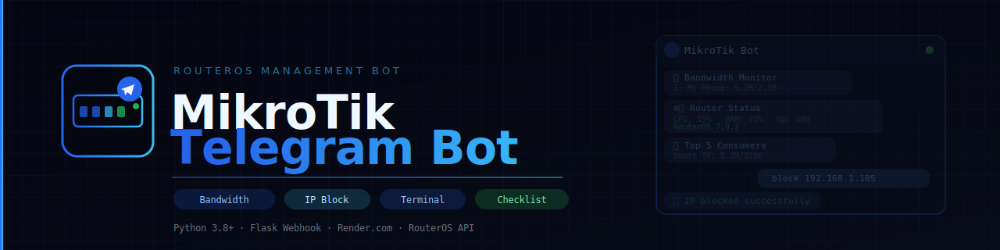

# MikroTik Telegram Bot



[](https://opensource.org/licenses/MIT)
[](https://www.python.org/)
[](https://flask.palletsprojects.com/)
[](https://github.com/SamoTech/mikrotik-telegram-bot/stargazers)
[](https://github.com/SamoTech)
[](https://twitter.com/OssamaHashim)
[](https://github.com/sponsors/SamoTech)
[](https://www.linkedin.com/in/ossamahashim/)
[](mailto:samo.hossam@gmail.com)
[](https://github.com/SamoTech/mikrotik-telegram-bot)

A powerful Telegram bot for managing and monitoring MikroTik RouterOS devices via webhook-based Flask application. Optimized for cloud deployment on Render.com.

## Features

### Core Monitoring
- **📊 Bandwidth Monitor** - Real-time bandwidth usage with device names
- **📱 Device Manager** - View all connected DHCP devices with IP addresses
- **⚙️ Router Status** - System health metrics (CPU, memory, uptime, version)
- **🔥 Top 5 Consumers** - Identify top bandwidth-consuming devices
- **📈 Traffic Analytics** - Interface-level RX/TX statistics
- **📝 System Logs** - View recent router logs

### Administrator Tools
- **🗂️ Backup Management** - Create timestamped router backups
- **🚫 Firewall Rules** - View active firewall filter rules
- **🔒 IP Management** - Block/unblock IP addresses in address lists
- **💻 Terminal Commands** - Execute RouterOS API commands directly
- **📋 Daily Checklist** - Comprehensive system health monitoring report

## Prerequisites

- Python 3.8+
- MikroTik RouterOS device with API enabled
- Telegram Bot Token (from [@BotFather](https://t.me/BotFather))
- Cloud hosting with internet access (Render.com, Heroku, etc.)

## Installation

### 1. Clone Repository
```bash
git clone https://github.com/SamoTech/mikrotik-telegram-bot.git
cd mikrotik-telegram-bot
```

### 2. Install Dependencies
```bash
pip install -r requirements.txt
```

### 3. Configure MikroTik RouterOS

Enable API on your MikroTik device:
```
/ip service enable api
/ip service set api address=0.0.0.0/0 port=8728
```

Create a user account for the bot:
```
/user add name=telegram password=StrongPassword group=full
```

### 4. Set Environment Variables

Create a `.env` file or set environment variables:

```bash
BOT_TOKEN=your_telegram_bot_token_here
ROUTER_HOST=192.168.0.1
ROUTER_PORT=8728
ROUTER_USER=telegram
ROUTER_PASS=StrongPassword
ADMIN_IDS=123456789,987654321
PORT=10000
```

### 5. Configure Telegram Webhook

```bash
curl -X POST https://api.telegram.org/bot{BOT_TOKEN}/setWebhook \
  -H "Content-Type: application/json" \
  -d '{"url": "https://your-app-url.com/{BOT_TOKEN}"}'
```

## Deployment

1. Push code to GitHub
2. Create new Web Service on [Render](https://render.com)
3. Connect your GitHub repository
4. Set environment variables in Render dashboard
5. Deploy

## Usage

| Command | Function |
|---------|----------|
| 📊 Speed | Show current bandwidth usage |
| 📱 Devices | List connected devices |
| ⚙️ Status | Show router status |
| 🔥 Top5 | Top 5 bandwidth consumers |
| 📈 Traffic | Interface traffic stats |
| 📝 Logs | Recent system logs |

### Admin Commands

| Command | Function |
|---------|----------|
| 🗂️ Backup | Create configuration backup |
| 🚫 Firewall | View firewall rules |
| 🔒 Block IP | Block an IP address |
| ✅ Unblock IP | Unblock an IP address |
| 💻 Terminal | Execute RouterOS commands |
| 📋 Checklist | Daily system health report |

## Security Considerations

1. Use strong credentials for RouterOS API user
2. Only grant bot admin access to trusted Telegram accounts
3. Restrict API access to your server IP if possible
4. All admin actions are logged with user IDs

## License

MIT License - Feel free to modify and distribute

---

**Made with ❤️ in Cairo by [Ossama Hashim](https://github.com/SamoTech)**
